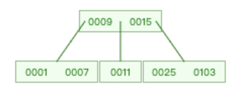
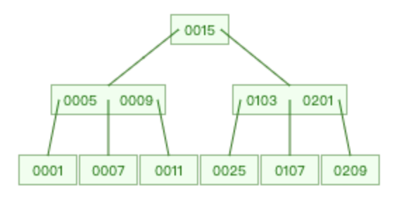

插入序列: 103, 9, 1, 7, 11, 15, 25, 201, 209, 107, 5, 14, 12, 7, 23

**insert: 103**

**insert: 9**

**insert: 1**

**insert: 7**

**insert: 11**

**insert: 15**

**insert: 25**

**insert: 201**

**insert: 209**

**insert: 107**

**insert: 5**

**insert: 14**

**insert: 12**

**insert: 7**

**insert: 23**

