## Closed Hash Tables  闭合哈希表 (Open Addressing 开放定址法)

### 插入数字序列

**insert: 103**
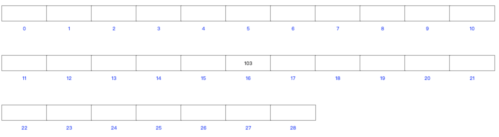

**insert: 9**
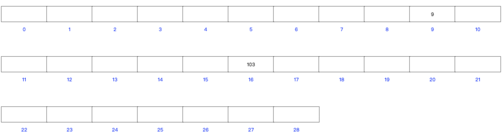

**insert: 1**
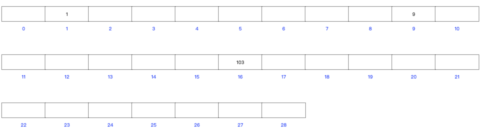

**insert: 7**
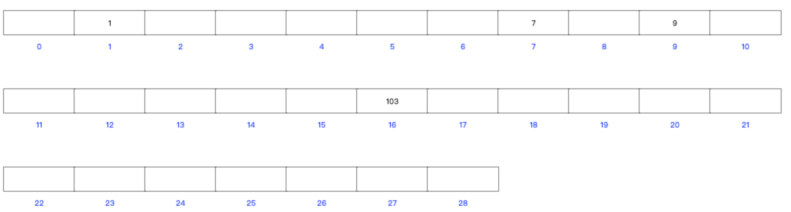

**insert: 11**
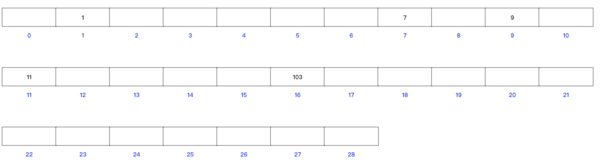

**insert: 11**
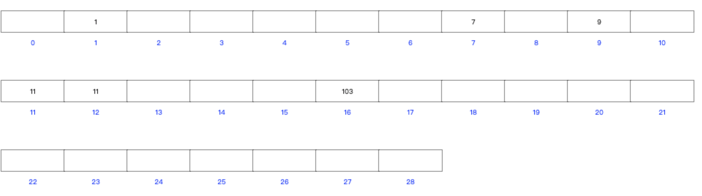

**insert: 12**
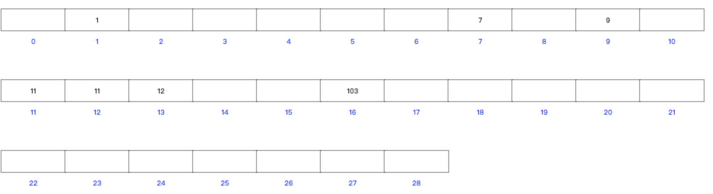

**insert: 28**
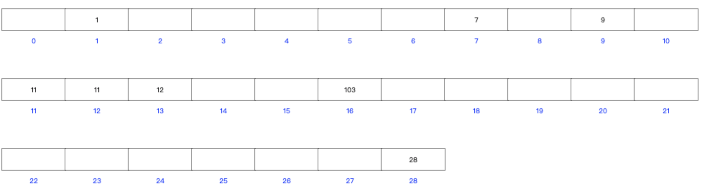

**insert: 28**
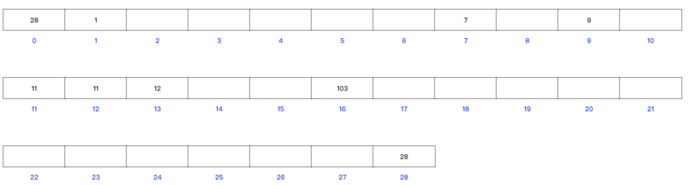

**insert: 所有空白位子的数字**
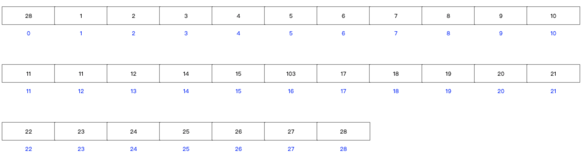

**insert: 5**
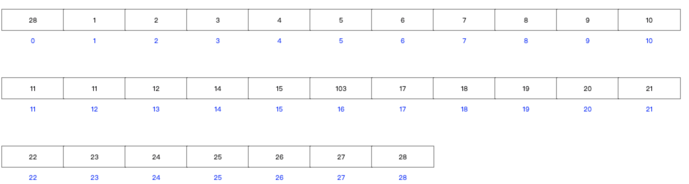

